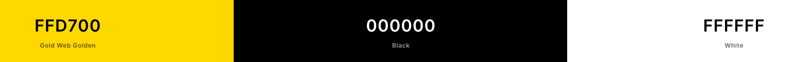

# Harry Potter Sorting Hat Quiz
## Portfolio Project 2 - Javascript

## Live Site

[Sorting Hat Quiz](https://tom-ainsworth.github.io/sorting-hat-quiz/)

## Repository

[Sorting Hat Quiz Repository](https://github.com/Tom-Ainsworth/sorting-hat-quiz)

***
## Contents
- [Purpose](#purpose)
- [Objective](#objective)
- [User Experience](#user-experience)
    - [User Stories](#user-stories)
    - [UXD User Experience Design](#uxd-user-experience-design)
- [Initial Plan](#initial-plan)
    - [Wireframes](#wireframes)
- [Features](#features)
    - [Current Features](#current-features)
    - [Features Left to Implement](#features-left-to-implement)
- [Technologies Used](#technologies-used)
    - [Languages](#languages)
    - [Other Technologies](#other-technologies)
- [Testing](#testing)
    - [Code Validation](#code-validation)
    - [Testing User Stories](#testing-user-stories)
        - [First Time Visitor Goals](#first-time-visitor-goals)
        - [Returning Visitor Goals](#returning-visitor-goals)
        - [Frequent User Goals](#frequent-user-goals)
    - [Further Testing](#further-testing)
    - [Lighthouse Results](#lighthouse-results)
        - [Mobile](#mobile)
        - [Desktop](#desktop)
- [Bugs](#bugs)
    - [Known Bugs](#known-bugs)
    - [Fixed Bugs](#fixed-bugs)
- [Deployment](#deployment)
    - [Github Pages](#github-pages)
- [Credits](#credits)
    - [Code](#code)
    - [Content](#content)
    - [Acknowledgements](#acknowledgements)
***

## Purpose

The purpose of this project is to demonstrate my ability in creating an interactive web application using Javascript, which has user input, feedback and replayability.

## Objective

The object of this application is to give the user a multiple choice personality question, that will sort answers and output a result based on the top score. The theme is Harry Potter Hogwarts Houses.

The needs within this project are not genuine and are made purely for the purpose of completing my Code Institute project.

This project is inspired by the sorting hat quiz that used to be featured on [Pottermore](https://en.wikipedia.org/wiki/Pottermore)
The website should have:

- A multiple choice quiz.
- An instructions page on how and why to play.
- A page to display results depending on the user input
- A way to replay the quiz and choose different answers.
- A consisten layout and colour scheme.

## User Experience

-   ### User stories

    -   Here are some example user stories that I factored in when designing the website.
      - As a Harry Potter fan, I am looking for an easily accessible quiz for me and my friends to play, and find out which house we belong to
      - As a person new to the franchise, I want to understand what this quiz is and how it relates to the franchise.
      - As someone who did the Pottermore quiz many years ago, I am interested in reminiscing and seeing if I am still in the same house as before.
      - As a regular user, I want to test out which combination of answers will put me in a certain house.

-   ### UXD User Experience Design
    -   #### Colour Scheme
    I used [coolors.co](https://coolors.co/) to generate the colour scheme and check contrast values.
    
        -   I kept the colour scheme simple to aid accessibility. The site features a black background throughout, with predominantly whit text. For the buttons and border I chose to use a shade of gold #ffd700 as it stands out and has a high contrast score, allowing all users to see the content at all times
    -   #### Typography
        -   I used [Google Fonts](https://fonts.google.com/) to get a combination of EB Garamond for the headings and buttons, and Open-Sans for the rest of the text. Garamond looks quite similar to some of the fonts used in the Harry Potter franchise, and is more widely available than using a custom font to get it exactly right. Open sans looks great next to it for more informative sections including the instructions and answer options.
    -   #### Imagery
        -   The images used were from, [ShutterStock](https://www.shutterstock.com/) results images, and [Icon Finder](https://www.iconfinder.com/) for the favicons. I was pleased that the results images were vector images, making it incredibly easy to resize to the exact measurements I needed, therefore not loading any unnecessary files. To compress the images I used [TinyPNG](https://tinypng.com/).

## Initial Plan

This project was definitely a huge learning curve in comparison to HTML and CSS. I went back and forth on a few ideas before landing on the quiz, including a Blackjack game and Connect4. Once I'd settled on this, I first wanted to have a single answer be the correct one from each question, but I thought it would be more fun for the user to have a sorting hat quiz that could collect the results and sort them in order of the highest score, resulting in a house choice.
 
As the main focus was on the Javascript behind the scenes. I was able to keep the design fairly simple. Starting with a mobile first approach, I essentially just scaled various part up to suit the larger displays.

### Wireframes

[Wireframes - Seperate document](assets/readme-content/wireframes.md)

I have included mockups for mobile, tablet and desktop wireframes, all of which are virtually the same design with different sizes.

## Features

[See All Features](assets/readme-content/features.md)
### Current Features

1. The Home Page is the first thing the user sees on entering the site. It shows a clear title and has some text to introduce what the site does.

1. Call to Action Buttons are all over the site, and are the only way for the user to navigate the site. As such, they need to be clear in what they do so there is no confusion for the user.

1. The Quiz Page is most likely where the user will spend most of their time. It has a simple layout, and utilises innerHTML to display each question in order.

1. The Start Again Button gives the user te chance to erase their current answer scores and return to the main menu to start fresh

1. By letting the user select an option before submitting it, they are less likely to choose an option they didn't mean to. The selected option is always highlighted, about because they are radio buttons, only one can be selected and submitted. An alert will show should the user press submit without choosing an option.

1. The Submit button is also required to process the users current answer. This is once again to allow an extra step for the user to be sure that they want to continue. Once this has ben pressed, a function will run to determine the next step.

1. The Results Page hides the quiz, and displays the house with the most answers. In the event of a tied score, the function will return the house closest to the start of the array (Gryffindor, Ravenclaw, Hufflepuff, Slytherin). This way the user still has a single answer, rather than splitting in half.

1. The Instructions page is an optional extra for any user who does not know what the Sorting Hat does. It displays a list of friendly, thematic instructions to give the user full details on what the website does.
[Instructions Page](feature-instructions-iphone-12.png)

### Features Left to Implement

1. I would like the quiz to display the question in a random order, and the answer options too. Currently, if a user were to click optionA for every answer, they would always get Gryffindor for their result. It would be more fun for the user to not be able to control this.

1. I would like to implement a back button, and perhaps get rid of the submit button. I wasn't able to think of the logic required to create a back function that would work fully, so I thought that having the submit button would minimise potential user error during the quiz.

1. I would like to add some sound effects to the quiz, that the user can toggle on or off. These could be general background music, as well as sounds that play on click, or depending on the result shown.

1. I would like to add some keydown functionality, so that users without a mouse are able to fully control the site with ease. The keys used could be 'enter' for submit. A,B, C, D, for choosing an answer option. M for menu to return to the beginning. P for previous question. The possibilities are endless!

1. As long as it did not hinder accessibilty, I would like to implement some background images through the quiz, perhaps even images depending one which answer was given.

## Technologies Used

### Languages

1. [HTML5](https://en.wikipedia.org/wiki/HTML5)
1. [CSS3](https://en.wikipedia.org/wiki/CSS)
1. [JS](https://en.wikipedia.org/wiki/JavaScript)

### Other Technologies

1. [ShutterStock:](https://www.shutterstock.com/)
    - Shutterstock was used to get licensed images for the results page.
1. [Google Fonts:](https://fonts.google.com/)
    - Google fonts were used to import the EB Garamond and Open Sans fonts.
1. [GitHub:](https://github.com/)
    - GitHub is used to store the projects code after being pushed from Git.
1. [TinyPNG:](https://tinypng.com/)
    - TinyPNG was used to compress image file sizes.
1. [Balsamiq:](https://balsamiq.com/)
    - Balsamiq was used to create the [Wireframes](assets/readme-content/wireframes.md) during the design process.
1. [W3Schools:](https://www.w3schools.com/)
    - W3Schools was used for quick access to tutorials, particularly for Javascript methods.
1. [CodePen:](https://codepen.io/) was used to test out ideas in real time, particilary for CSS.
1. [Stack Overflow:](https://stackoverflow.com/) was used to referencee ideas and syntax, particulary in javascript.

## Testing

### Code Validation

The W3C Markup Validator and W3C CSS Validator Services were used to validate every page of the project to ensure there were no syntax errors in the project.

-   [W3C Markup Validator](https://validator.w3.org/#validate_by_uri) - [Results](https://validator.w3.org/nu/?doc=https%3A%2F%2Ftom-ainsworth.github.io%2Fsorting-hat-quiz%2F)

-   [W3C CSS Validator](https://jigsaw.w3.org/css-validator/) - [Results](https://jigsaw.w3.org/css-validator/validator?uri=https%3A%2F%2Ftom-ainsworth.github.io%2Fsorting-hat-quiz%2F&profile=css3svg&usermedium=all&warning=1&vextwarning=&lang=en)

-   [JShint Code Quality Tool](https://jshint.com/) - 
With the default settings the only messages that come up are in relation to defining functions with const and let. With the configuration setting 'New JavaScript features (ES6)' active, no erros show (As demonstrated in the screenshot).

### Lighthouse Testing

- [LightHouse Testing](https://developers.google.com/web/tools/lighthouse)
#### Mobile Testing

#### Desktop Testing

I'm unsurprisingly really pleased with these results. Both ran in Incognito mode as recommended.

### Further Testing

-   The Website was tested on Google Chrome and Safari, on iOS and iPadOS.
-   The website was tested on Chrome, Safari and Firefox on laptop.
-   The website was viewed on a variety of devices such as Laptop, iPad, iPad Pro, iPhone SE, iPhone 12.
-   A large amount of testing was done to ensure that all pages were linking correctly, and displaying the intended results from the functions
-   Friends and family members were asked to review the site and documentation to point out any bugs and/or user experience issues.
-   regular console logs were done through the development to ensure the correct data is being accessed and stored.

## Bugs

### Known Bugs
-   I had several issues when adding media queries that caused the outer-border and inner-border div that was present for the most part to not surrround all of the content within. I tried several changes to position but ended up replacing it with a single content-container. This does not surround the entire window on certain screens, but I did my best to cover the majority.

### Fixed Bugs
- Bug 1: #answer-options being li elements isn’t a best practice, and made it hard to read data from them.
  
  Solution: I changed the li elements to a fieldset of radio buttons. This was both a functional and semantic choice, as making a multiple choice quiz using li elements is not the intended purpose for these. When calling and collecting the data in Javascript it will be much easier to do with buttons as they already have a built in “submit” characteristic, where as li’s would have to be manipulated to act as a button, or add the necessary attributes to receive their data, resulting in unnecessary code.
- Bug 2: Styling radio inputs and labels.
  
  Solution: Because radio inputs require a label to work effectively, it meant I had to style the two individually, which was not something I had come across before. I found an amazing way of creating the buttons I wanted, with some extra effects via Ivan Grozdic’s [CodePen tutorial](https://codepen.io/ig_design/pen/dLNKgM). The button styling was very complex for what I’d done before, so it took some time just to understand what each selector was actually doing to the html. After a lot of experimentation with removing and changing properties, I was able to apply my own styles to suit the project, making sure that the element IDs and classes were descriptive, and relevant to my project. (See bug 4 for update on this as it is now permanently in the quiz-page section).

- Bug 3: quiz-page elements not keeping their position when moving from question to question.
    
    Solution: Due to the content in the answer-options boxes varying so much, the submit button and all option boxes would move around between questions displaying. To fix this, I thought about removing the submit button from the fieldset, and then fixing it in position and using the top and/or bottom properties to style it. This caused problems when I then expanded the window, and didn’t seem like it would be very responsive. After a chat with my mentor Anto, we decided that increasing the height of the fieldset element would leave enough room for the submit button to stay in position regardless of the other elements. I also made adjustments to the answer-options CSS and the question-title for the same reasons. After going through the whole quiz, this worked really well.

- Bug 4: showNextQuestion() duplicating the evenListener on the submit button each time it was called.
    
    Solution: I discovered this bug while testing out solutions for bug 5. When I first added the innerHTML part of this function, i was creating the submit-btn for the quiz within the fieldset as I didn’t know any different. Because of this, I needed to add an eventListener for the submit button, to prevent the default action, and proceed with submitting the answer and displaying the next question. This worked well for a while until bug 2 came around. I chose to remove this element from the showNextQuestion and keep it in the html page, but because the eventListener was still within the function, it was being stored and called over and over, which meant that the scores were being duplicated. By changing the scope of this listener from local to global by putting it at the top of the Javascript file, it meant that it wouldn’t be called multiple times per click.

- Bug 5: results page showing multiple house divs when replaying the quiz. 
  
    Solution: After I’d added the results page images so that they would display the correct house. I noticed that when I would return to the menu and play again, the results divs were stacking. I logged the scores at several points, as I believed it was an issue with the collectResultsAndDisplayHouse() function. i went through several iterations of this code, using the original finalScores array info, however it still didn’t work. To fix it I had to break down exactly what I wanted the result to be:
      1. gather the house scores
      2. sort them from highest to lowest
      3. Show the top scoring house div in the html page

    At first I made an overly complicated if/else statement to find the winning result, based on whether the losing results were the first value in the array. Once I did the breakdown however, I realised that I simply needed to “show” the winning result, rather than “hide” everything else. I restructured the finalScores array to give me an elementID (the results IDs from the results-page) and a points score, this way a single line of code: document.getElementById(finalScores[0].elementId).classList.remove('hidden'); allowed me to show the final results. 
    
    After all this, the results pages were still duplicating, but I was confident that the collectResultsAndDisplayHouse() function wasn’t the cause. I realised that when resetting the quiz, I wasn’t hiding any of the results pages. To fix this, I added code in the startAgainFromMenu() code to add the hidden class to all results, which worked perfectly.

## Deployment

### GitHub Pages

The project was deployed to GitHub Pages using the following steps...

1. Log in to GitHub and locate the [GitHub Repository](https://github.com/Tom-Ainsworth/sorting-hat-quiz)
2. At the top of the Repository (not top of page), locate the "Settings" Button on the menu.
    - Alternatively Click [Here](https://pages.github.com/) for a page with instructions on how to use Github Pages
3. Scroll down the Settings page until you locate the "GitHub Pages" Section.
4. Under "Source", click the dropdown called "None" and select "Main".
5. The page will automatically refresh.
6. Scroll back down through the page to locate the now published site [link](https://tom-ainsworth.github.io/sorting-hat-quiz/) in the "GitHub Pages" section.

## Credits

### Code

-   The original codepen code to style the radio buttons can be found [here](https://codepen.io/ig_design/pen/dLNKgM)

-   [W3Schools](https://www.w3schools.com/) : For various tutorials and explanations of properties. 

-   [Stack Overflow](https://stackoverflow.com/) : For various javascript references.

-   Code was used from [Google Fonts](https://fonts.google.com/) to import the font family within my CSS file.

### Content

-   All code was written by myself apart from the segments above, which were adapted to suit the sites needs.
-   README.md Template courtesy of Code Instite, with layout inspiration from [Dave Horrocks](https://github.com/DaveyJH)

### Acknowledgements

-   My friends Richard Stratton & Ed Barron for support with some of the more complex javascript tasks(for me at least!) such as reading the radio button data, and turning that data into a result

-   My Mentor Antonio Rodriguez for helpful feedback and ideas, it amazes me how quickly and effectively you fix problems!

-   The September 2021 Slack group for constant support for one another and bumps when feeling overwhelmed.

-   Fellow CI student Dave Horrocks, who was kind enough to jump on a call with me at short notice to work through various javascript bugs.