# Harry Potter Sorting Hat Quiz
## Portfolio Project 2 - Javascript

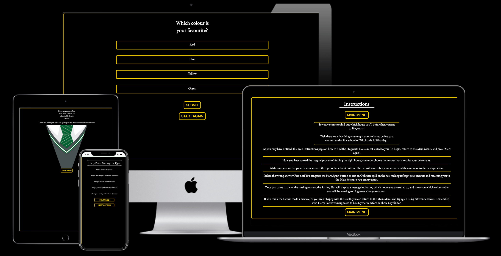

## Live Site

[Sorting Hat Quiz](https://tom-ainsworth.github.io/sorting-hat-quiz/)

## Repository

[Sorting Hat Quiz Repository](https://github.com/Tom-Ainsworth/sorting-hat-quiz)

***
## Contents
- [Purpose](#purpose)
- [Objective](#objective)
- [User Experience](#user-experience)
    - [User Stories](#user-stories)
    - [UXD User Experience Design](#uxd-user-experience-design)
- [Initial Plan](#initial-plan)
    - [Wireframes](#wireframes)
- [Features](#features)
    - [Current Features](#current-features)
    - [Features Left to Implement](#features-left-to-implement)
- [Technologies Used](#technologies-used)
    - [Languages](#languages)
    - [Other Technologies](#other-technologies)
- [Testing](#testing)
    - [Code Validation](#code-validation)
    - [Testing User Stories](#testing-user-stories)
        - [First Time Visitor Goals](#first-time-visitor-goals)
        - [Returning Visitor Goals](#returning-visitor-goals)
        - [Frequent User Goals](#frequent-user-goals)
    - [Further Testing](#further-testing)
    - [Lighthouse Results](#lighthouse-results)
        - [Mobile](#mobile)
        - [Desktop](#desktop)
- [Bugs](#bugs)
    - [Known Bugs](#known-bugs)
    - [Fixed Bugs](#fixed-bugs)
- [Deployment](#deployment)
    - [Github Pages](#github-pages)
- [Credits](#credits)
    - [Code](#code)
    - [Content](#content)
    - [Acknowledgements](#acknowledgements)
***

## Purpose

The purpose of this project is to demonstrate my ability in creating an interactive web application using Javascript, which has user input, feedback and replayability.

## Objective

The object of this application is to give the user a multiple choice personality question, that will sort answers and output a result based on the top score. The theme is Harry Potter Hogwarts Houses.

The needs within this project are not genuine and are made purely for the purpose of completing my Code Institute project.

This project is inspired by the sorting hat quiz that used to be featured on [Pottermore](https://en.wikipedia.org/wiki/Pottermore)
The website should have:

- A multiple choice quiz.
- An instructions page on how and why to play.
- A page to display results depending on the user input
- A way to replay the quiz and choose different answers.
- A consisten layout and colour scheme.

## User Experience

-   ### User stories

    -   Here are some example user stories that I factored in when designing the website.
      - As a Harry Potter fan, I am looking for an easily accessible quiz for me and my friends to play, and find out which house we belong to
      - As a person new to the franchise, I want to understand what this quiz is and how it relates to the franchise.
      - As someone who did the Pottermore quiz many years ago, I am interested in reminiscing and seeing if I am still in the same house as before.
      - As a regular user, I want to test out which combination of answers will put me in a certain house.

-   ### UXD User Experience Design
    -   #### Colour Scheme
    I used [coolors.co](https://coolors.co/) to generate the colour scheme and check contrast values.
    !(assets/readme-content/images/color-palette.png)
        -   I kept the colour scheme simple to aid accessibility. The site features a black background throughout, with predominantly whit text. For the buttons and border I chose to use a shade of gold #ffd700 as it stands out and has a high contrast score, allowing all users to see the content at all times
    -   #### Typography
        -   I used [Google Fonts](https://fonts.google.com/) to get a combination of EB Garamond for the headings and buttons, and Open-Sans for the rest of the text. Garamond looks quite similar to some of the fonts used in the Harry Potter franchise, and is more widely available than using a custom font to get it exactly right. Open sans looks great next to it for more informative sections including the instructions and answer options.
    -   #### Imagery
        -   The images used were from, [ShutterStock](https://www.shutterstock.com/) results images, and [Icon Finder](https://www.iconfinder.com/) for the favicons. I was pleased that the results images were vector images, making it incredibly easy to resize to the exact measurements I needed, therefore not loading any unnecessary files. To compress the images I used [TinyPNG](https://tinypng.com/).

## Initial Plan

This project was definitely a huge learning curve in comparison to HTML and CSS. I went back and forth on a few ideas before landing on the quiz, including a Blackjack game and Connect4. Once I'd settled on this, I first wanted to have a single answer be the correct one from each question, but I thought it would be more fun for the user to have a sorting hat quiz that could collect the results and sort them in order of the highest score, resulting in a house choice.
 
As the main focus was on the Javascript behind the scenes. I was able to keep the design fairly simple. Starting with a mobile first approach, I essentially just scaled various part up to suit the larger displays.

### Wireframes

[Wireframes - Seperate document](assets/readme-content/wireframes.md)

I have included mockups for mobile, tablet and desktop wireframes, all of which are virtually the same design with different sizes.
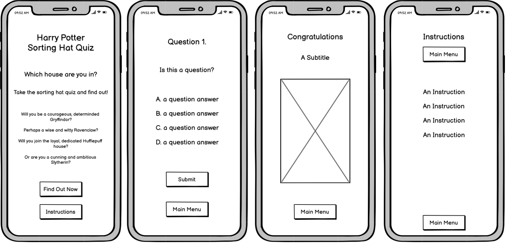

## Features

[See All Features](assets/readme-content/features.md)
### Current Features

1. The Home Page is the first thing the user sees on entering the site. It shows a clear title and has some text to introduce what the site does.
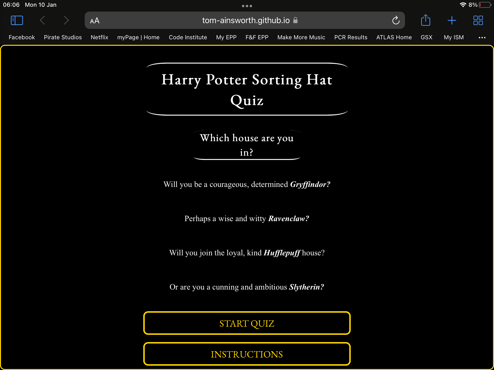

1. Call to Action Buttons are all over the site, and are the only way for the user to navigate the site. As such, they need to be clear in what they do so there is no confusion for the user.
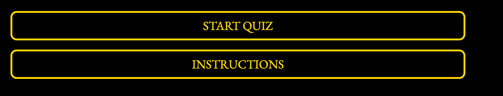

1. The Quiz Page is most likely where the user will spend most of their time. It has a simple layout, and utilises innerHTML to display each question in order.
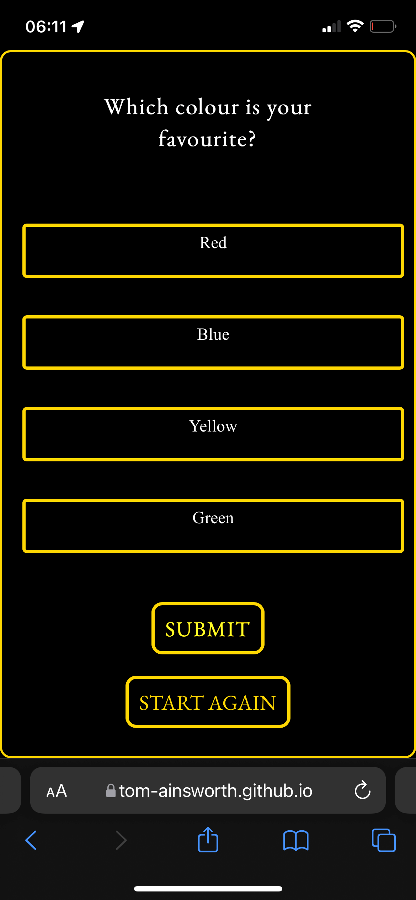

1. The Start Again Button gives the user te chance to erase their current answer scores and return to the main menu to start fresh
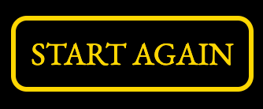

1. By letting the user select an option before submitting it, they are less likely to choose an option they didn't mean to. The selected option is always highlighted, about because they are radio buttons, only one can be selected and submitted. An alert will show should the user press submit without choosing an option.
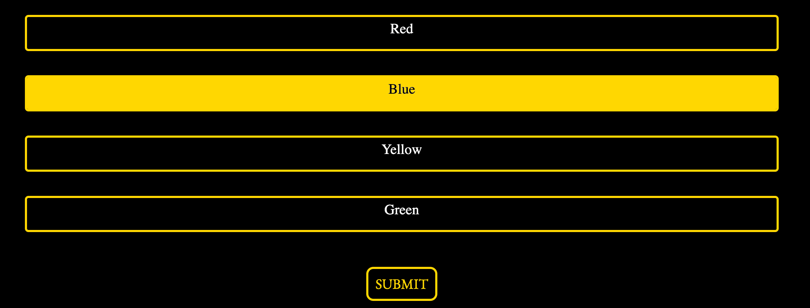

1. The Submit button is also required to process the users current answer. This is once again to allow an extra step for the user to be sure that they want to continue. Once this has ben pressed, a function will run to determine the next step.

1. The Results Page hides the quiz, and displays the house with the most answers. In the event of a tied score, the function will return the house closest to the start of the array (Gryffindor, Ravenclaw, Hufflepuff, Slytherin). This way the user still has a single answer, rather than splitting in half.
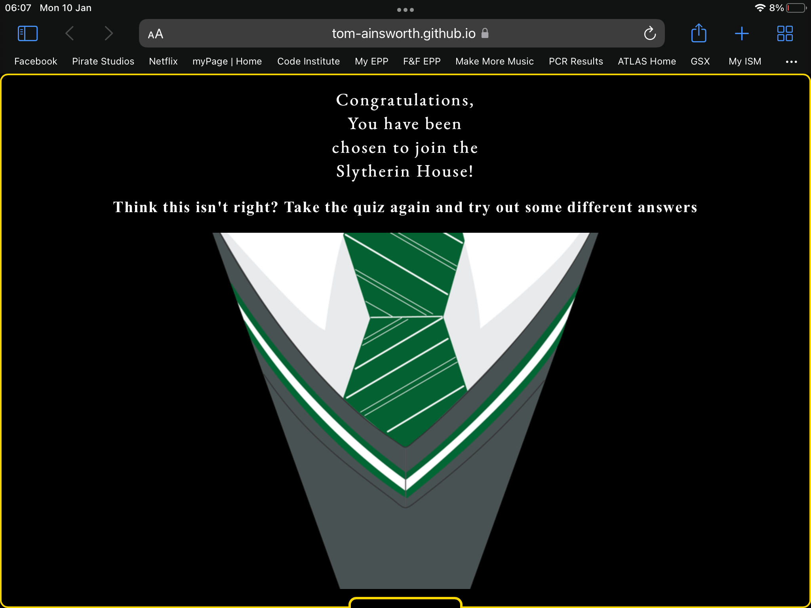

1. The Instructions page is an optional extra for any user who does not know what the Sorting Hat does. It displays a list of friendly, thematic instructions to give the user full details on what the website does.
[Instructions Page](feature-instructions-iphone-12.png)

### Features Left to Implement

1. I would like the quiz to display the question in a random order, and the answer options too. Currently, if a user were to click optionA for every answer, they would always get Gryffindor for their result. It would be more fun for the user to not be able to control this.

1. I would like to implement a back button, and perhaps get rid of the submit button. I wasn't able to think of the logic required to create a back function that would work fully, so I thought that having the submit button would minimise potential user error during the quiz.

1. I would like to add some sound effects to the quiz, that the user can toggle on or off. These could be general background music, as well as sounds that play on click, or depending on the result shown.

1. I would like to add some keydown functionality, so that users without a mouse are able to fully control the site with ease. The keys used could be 'enter' for submit. A,B, C, D, for choosing an answer option. M for menu to return to the beginning. P for previous question. The possibilities are endless!

1. As long as it did not hinder accessibilty, I would like to implement some background images through the quiz, perhaps even images depending one which answer was given.

## Technologies Used

### Languages

1. [HTML5](https://en.wikipedia.org/wiki/HTML5)
1. [CSS3](https://en.wikipedia.org/wiki/CSS)
1. [JS](https://en.wikipedia.org/wiki/JavaScript)

### Other Technologies

1. [ShutterStock:](https://www.shutterstock.com/)
    - Shutterstock was used to get licensed images for the results page.
1. [Google Fonts:](https://fonts.google.com/)
    - Google fonts were used to import the EB Garamond and Open Sans fonts.
1. [GitHub:](https://github.com/)
    - GitHub is used to store the projects code after being pushed from Git.
1. [TinyPNG:](https://tinypng.com/)
    - TinyPNG was used to compress image file sizes.
1. [Balsamiq:](https://balsamiq.com/)
    - Balsamiq was used to create the [Wireframes](assets/readme-content/wireframes.md) during the design process.
1. [W3Schools:](https://www.w3schools.com/)
    - W3Schools was used for quick access to tutorials, particularly for Javascript methods.
1. [CodePen:](https://codepen.io/) was used to test out ideas in real time, particilary for CSS.
1. [Stack Overflow:](https://stackoverflow.com/) was used to referencee ideas and syntax, particulary in javascript.

## Testing

### Code Validation

The W3C Markup Validator and W3C CSS Validator Services were used to validate every page of the project to ensure there were no syntax errors in the project.

-   [W3C Markup Validator](https://validator.w3.org/#validate_by_uri) - [Results](https://validator.w3.org/nu/?doc=https%3A%2F%2Ftom-ainsworth.github.io%2Fsorting-hat-quiz%2F)
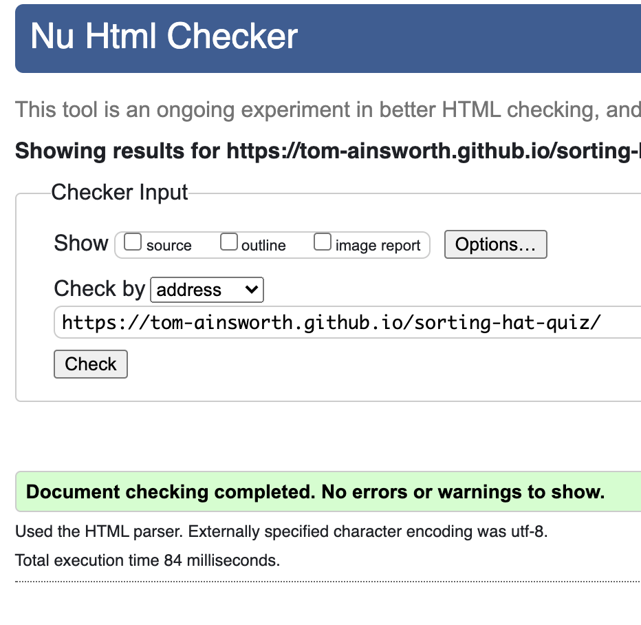

-   [W3C CSS Validator](https://jigsaw.w3.org/css-validator/) - [Results](https://jigsaw.w3.org/css-validator/validator?uri=https%3A%2F%2Ftom-ainsworth.github.io%2Fsorting-hat-quiz%2F&profile=css3svg&usermedium=all&warning=1&vextwarning=&lang=en)

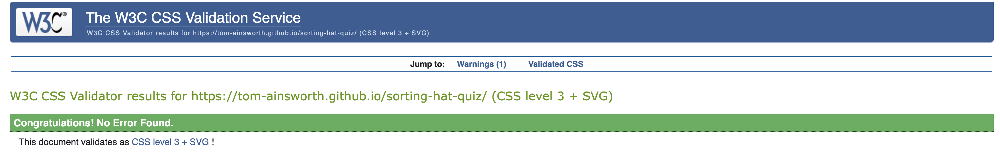

-   [JShint Code Quality Tool](https://jshint.com/) - 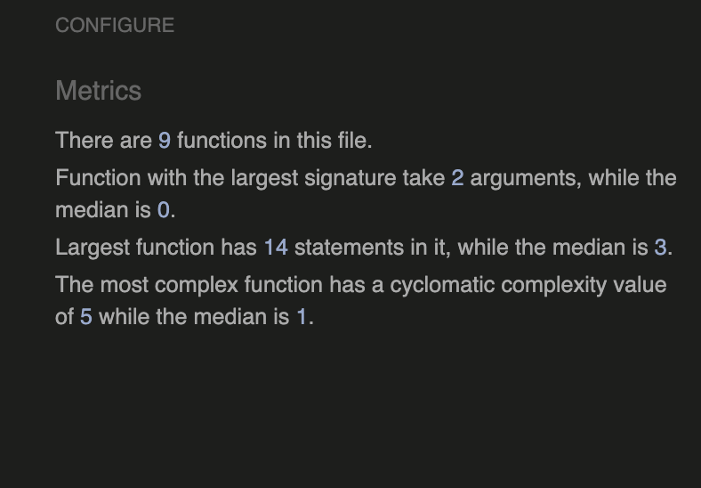
With the default settings the only messages that come up are in relation to defining functions with const and let. With the configuration setting 'New JavaScript features (ES6)' active, no erros show (As demonstrated in the screenshot).

### Lighthouse Testing

- [LightHouse Testing](https://developers.google.com/web/tools/lighthouse)
#### Mobile Testing
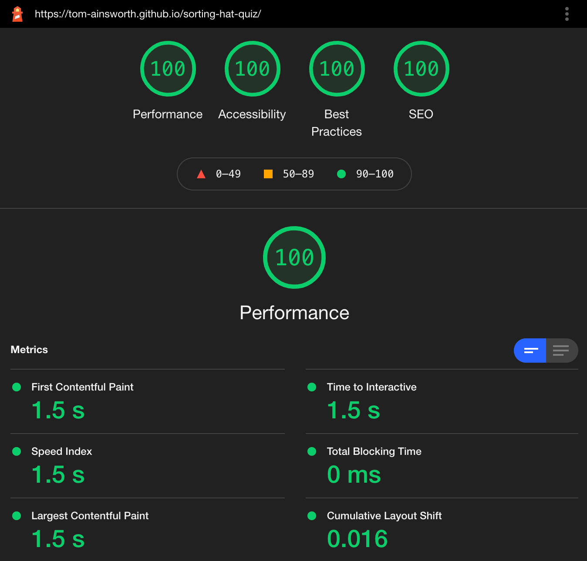

#### Desktop Testing
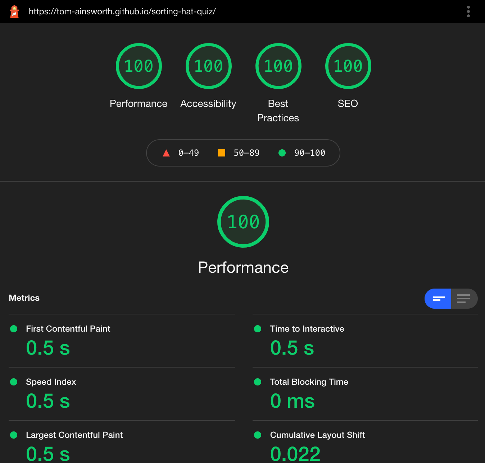
I'm unsurprisingly really pleased with these results. Both ran in Incognito mode as recommended.

### Testing User Stories

-   #### First Time Visitor Goals

    1. As a First Time Visitor, I want to easily understand the main purpose of the site and learn more about the organisation.

        1. Upon entering the site, users are automatically greeted with a clean and easily readable navigation bar to go to the page of their choice. Underneath there is a Hero Image with Text and a brief description about the company.
        2. The main points are made immediately with the hero image
        3. Beneath the description are 2 calls to actions, users can find out more, or get in touch. With the fold displaying more content to encourage scrolling. 

    2. As a First Time Visitor, I want to be able to easily be able to navigate throughout the site to find content.

        1. The site has been designed to be fluid, with a clear navigation bar with links to all sections of the page. 
        2. As mentioned, the call to action buttons are strategically placed between sections to give users something to interact with.
        3. On the Contact Us Page, after a form response is submitted, the submitted form loads on a seperate tab, so the user can go straight back to the site should they wish.

    3. As a First Time Visitor, I want to view the site on multiple devices at different times, and want the experience to be the same on all devices

        1. I created media queries to keep the user experience the same on the vast majority of screen sizes, with responsive text and images throughout.
        2. I added column-counts for tablet and desktop screen sizes to minimize scrolling, and display relevant content in the correct order. No sections overlap so the information heirarchy isn't disturbed.
        3. I added multiple hero image files depending on the screen width. I wanted the hero image to be appropriately sized as it is the first thing users see when the open the site.

-   #### Returning Visitor Goals

    1. As a Returning Visitor, I want to find out who is behind Blackshaw Theatre and what they do.

        1. The Tell Me More call to action takes users straight to the About section for quick access.
        2. All of the About images display info about the respective staff member when hovered over, empowering users to see the information they want. This also draws focus to the individual to help users concentrate on what they're looking at.

    2. As a Returning Visitor, I want to find the best way to get in contact with the organisation with any questions I may have.

        1. Below each show is a call to action to "get in touch" which takes the user to the contact section of the page.
        2. The whole site has a white background, apart from the contact form. This change of colour creates an emotive response for the user that the interaction on the page has changed, from viewing content, to submitting their own content.
        3. The footer contains social media links to Blackshaw Theatres pages. Some users are more familiar with communicating through these sites rather than via email, and so may choose to message through there. All links open in seperate tabs to keep focus on the main site.

    3. As a Returning Visitor, I want to find see what kind of presence they have on social media sites
        1. As mentioned above, should a user wish to simply browse the socials, they have the option to do so with the footer links.

-   #### Frequent User Goals

    1. As a Frequent User, I want to check to see if there are any new shows out to see.
        1. I changed the navigation bar name from "what's on" to "shows" during the site creation. This saved space on smaller screen sizes, allowing the nav bar to remain on one line, and also made it crystal clear what the section was relating to.
        2. Every show on the site is listed with the same format, making users feel comfortable and in control as they browse the site. This also allows future shows to be easily added or edited by another contributor.
        3. All shows include a link to the contact form in case users want to find out more.

    2. As a Frequent User, I want to purchase tickets for the shows while still being able to come back to the site
        1. Next to the "get in touch" button is a link to the relavent page to purchase tickets for the show. All of these pages are trustworthy, and users can feel safe being directed by Blackshaw for their own shows, rather than searching through 3rd party sites.

    3. As a Frequent User, I want to work with the company to produce a show, and speak with the owner directly.
        1. Throughout the page are CTA's linking to the contact form, and a specific input for businesses/companies to tell Blackshaw who they are.
        2. In the about section, users are introduced the the owner of Blackshaw Ellie, who managed the emails and social medias herself. When she replies to users they will feel safe knowing they are talking tot the owner, rather than someone else in the company.

### Further Testing

-   The Website was tested on Google Chrome, and Safari on iOS and iPadOS.
-   The website was tested on Chrome, Safari and Firefox on laptop and desktop.
-   The website was viewed on a variety of devices such as Desktop, Laptop, iPad, iPad Pro, iPhone7, iPhone X, iPhone SE & iPhone 12.
-   A large amount of testing was done to ensure that all pages were linking correctly.
-   Friends and family members were asked to review the site and documentation to point out any bugs and/or user experience issues.
-   I tested the page using GoogleDev Tools Lighthouse feature on both mobile and desktop settings

### Lighthouse Results

#### Mobile

#### Desktop

## Bugs

### Known Bugs
-   When reducing the site from around 1775px to 1575px, the About section images overlap slightly. The screen sizes I tested the site on do not show this at all, I only noticed it when manually dragging the screen down through these dimensions, as seen here:

### Fixed Bugs
- At first the hero image was set within HTML based on mobile device sizes. When it came to making the site responsive, I found it difficult to implement the picture element, and so opted to change this to a background image within CSS. This gave me far more flexibility to style the image, and meant that I could swap the image out with media queries, making the site look much better on all screen sizes.

- The text overlay on top of the hero image was only featured at the bottom of the screen on the W3Schools tutorial, so I had to figure out how to add it to the top as well. This went through several iterations of position changes, before I separated the text into cover-text-top and cover-text-bottom IDs. This made it much easier to style the text in relation to the hero image.

- The shows section wouldn't scale into multiple columns like the about section does. I would have liked it to display the show info, with the image below. However it would only split the text on the left, and the images on the right, which wasn't very appealing to look at. I tried the same method I used for the about section, seperating the shows by classes: "show-1, show-2" which gave this result:

I then tried adjusting the section as a whole, so that the content of each show div would stay together. However the h2 tag wouldn't stay central, and the buttons from the first show were being cut in half.

I actually fixed this bug as I was writing it down as a known bug. I simply added a container to the shows section, and left the h2 tag outside of it, therefore allowing the h2 to stay central, and giving the buttons enough room beneath the image. This one was very satisfying to fix!

- The overlay was causing me issues on the about section. I knew that I wanted to implement it quite early on, as I found it while researching image tags on [W3Schools](https://www.w3schools.com/howto/howto_css_image_overlay.asp). Tweaking the CSS properties from the code given took a lot of experimenting, as the positioning was very important to maintain the look of the site. As there are several class selectors, I needed to ensure I was calling the correct HTML, as my class names were different to that of the tutorial. I wanted to make this feature repeatable within a container "staff-bio" in case the client wanted to add any more staff members. At first I had indiviual height and width values for all selectors, however later decided to add inherited values to help with site maintainence.

- As I knew the site would be scaled up, I tried to make all text responsive from the get go, using the vw property to unify all elements of the same type. This worked quite well for mobile and tablet, but meant that desktop text was far too large. I researched more standardised sizings and noticed that major sites such as Apple, Facebook and Youtube had very similar pixel values for the relative elements. After adding these to media queries, and adjusting the primary sizing, the page looked far better when resizing the screen.

## Deployment

### GitHub Pages

The project was deployed to GitHub Pages using the following steps...

1. Log in to GitHub and locate the [GitHub Repository](https://github.com/Tom-Ainsworth/blackshaw-theatre)
2. At the top of the Repository (not top of page), locate the "Settings" Button on the menu.
    - Alternatively Click [Here](https://pages.github.com/) for a page with instructions on how to use Github Pages
3. Scroll down the Settings page until you locate the "GitHub Pages" Section.
4. Under "Source", click the dropdown called "None" and select "Main".
5. The page will automatically refresh.
6. Scroll back down through the page to locate the now published site [link](https://tom-ainsworth.github.io/blackshaw-theatre/) in the "GitHub Pages" section.

## Credits

### Code

-   The full-screen hero image code came from this [Pexels page](https://www.pexels.com/photo/silhouette-photography-of-people-on-theater-1714361/)

-   [W3Schools](https://www.w3schools.com/) : For various tutorials and explanations of properties. 
    - 
- Code was used from [Google Fonts](https://fonts.google.com/) to import the font family within my CSS file.

### Content

-   All code was written by myself apart from the segments above, which were adapted to suit the sites needs.
-   README.md Template courtesy of Code Instite, with layout inspiration from [Dave Horrocks](https://github.com/DaveyJH)

### Acknowledgements

-  My friends Richard Stratton & Ed Barron for support with some of the more complex javascript tasks, such as reading the radio button data, and turning that data into a result

-   My Mentor Antonio Rodriguez for helpful feedback and ideas, it amazes me how quickly and effectively you fix problems!

-   The September 2021 Slack group for constant support for one another and bumps when feeling overwhelmed.

-   Fellow CI student Dave Horrocks, who was kind enough to jump on a call with me at short notice to work through various javascript bugs.